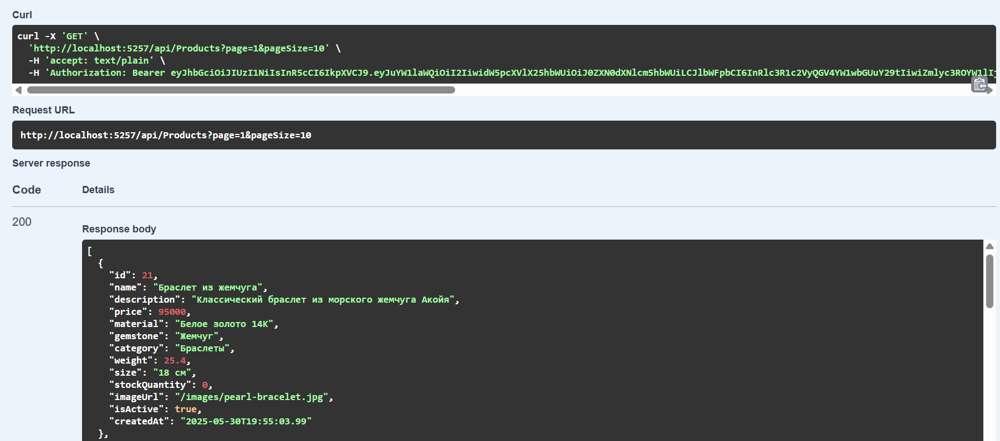
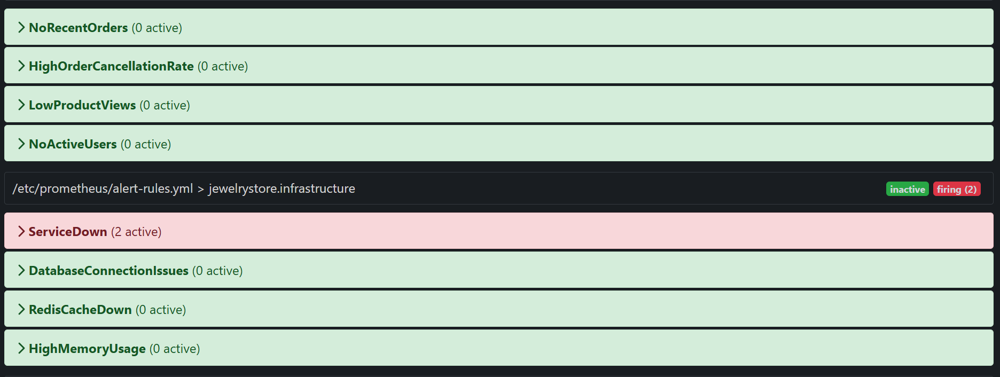

# Курсовая работа
## "Разработка клиент-серверного приложения с системой мониторинга"

**Студент:** Васильев Иван Денисович  
**Группа:** [Номер группы]  
**Преподаватель:** [ФИО преподавателя]  
**Дата:** [Дата сдачи]

---

## Введение

В современном программировании особое значение приобретают технологии, обеспечивающие надёжность, масштабируемость и управляемость информационных систем. Целью данной курсовой работы является создание клиент-серверного приложения для управления ювелирным интернет-магазином с применением современных подходов: контейнеризации, кэширования, событийно-ориентированной архитектуры и системы мониторинга. В качестве предметной области выбран интернет-магазин ювелирных изделий, что позволяет продемонстрировать работу с каталогом товаров, заказами и пользователями.

В ходе работы реализовано приложение JewelryStore, в котором используются следующие технологии:
- **Контейнеризация** (Docker, Docker Compose) — для изоляции компонентов приложения и обеспечения воспроизводимости среды;
- **Кэширование** (Redis) — для ускорения доступа к часто используемым данным;
- **Событийно-ориентированная архитектура** (RabbitMQ) — для асинхронного взаимодействия между компонентами;
- **Система мониторинга** (Prometheus и Grafana) — для сбора, хранения и визуализации метрик работы приложения и инфраструктуры.

Задачи курсовой работы:
- Проанализировать и описать используемые технологии и архитектурные подходы;
- Спроектировать архитектуру приложения с учётом требований к надёжности и масштабируемости;
- Реализовать основные бизнес-процессы (работа с товарами, заказами, пользователями);
- Интегрировать кэширование и событийную архитектуру;
- Настроить систему мониторинга и алертинга;
- Провести тестирование основных функций приложения.

---

## Теоретическая часть

### Платформа разработки: C# и .NET

C# — это современный объектно-ориентированный язык программирования, отличающийся строгой типизацией, развитой системой управления памятью и поддержкой современных парадигм разработки. Платформа .NET (в данной работе используется версия .NET 8) предоставляет кроссплатформенную среду выполнения, что позволяет запускать приложения на различных операционных системах. Среди преимуществ .NET — развитая экосистема библиотек, встроенная поддержка внедрения зависимостей, конфигурирования, логирования, а также высокая производительность и безопасность. В проекте JewelryStore .NET используется для реализации серверной части (Web API) и клиентского интерфейса (Blazor Server), что обеспечивает единство стека технологий и упрощает сопровождение кода.

### Контейнеризация

Контейнеризация — это технология, позволяющая упаковать приложение и все его зависимости в единый изолированный программный контейнер. Контейнеры обеспечивают одинаковое окружение для запуска приложения на различных платформах, что упрощает развертывание, масштабирование и сопровождение. В данной работе используется система контейнеризации Docker, а для управления многоконтейнерными приложениями — инструмент Docker Compose.

**Docker** — это программная платформа, позволяющая создавать, запускать и управлять контейнерами. Каждый контейнер содержит всё необходимое для работы приложения: исполняемые файлы, библиотеки, переменные окружения и конфигурационные файлы. Это обеспечивает переносимость и независимость от особенностей операционной системы. Docker позволяет быстро развернуть приложение в любом окружении, минимизируя риски, связанные с несовместимостью зависимостей. В проекте JewelryStore с помощью Docker контейнеризируются все компоненты системы: серверное приложение, база данных, кэш, брокер сообщений и инструменты мониторинга. Docker Compose позволяет описать всю инфраструктуру в одном конфигурационном файле и управлять запуском всех сервисов одной командой.

### Кэширование

Кэширование — процесс временного хранения часто используемых данных с целью ускорения доступа к ним и снижения нагрузки на основное хранилище данных. В качестве системы кэширования в проекте используется Redis — высокопроизводительное хранилище данных типа «ключ-значение», работающее в оперативной памяти.

**Redis** — это система управления базами данных с открытым исходным кодом, предназначенная для хранения структурированных данных в памяти. Redis поддерживает различные структуры данных (строки, списки, множества, хэши) и обеспечивает быстрый доступ к данным. В проекте реализован паттерн кэширования "cache-aside" (ленивое кэширование): приложение сначала обращается к кэшу, и только при отсутствии данных — к основной базе данных, после чего сохраняет результат в кэш. Redis отличается высокой производительностью, поддержкой масштабирования, возможностью настройки времени жизни ключей (TTL) и механизмами репликации и устойчивости к сбоям. В JewelryStore кэшируются наиболее востребованные данные, что позволяет значительно снизить нагрузку на основную базу данных и ускорить отклик системы для пользователей.

### Событийно-ориентированная архитектура

Событийно-ориентированная архитектура (event-driven architecture) — это подход к построению программных систем, при котором взаимодействие между компонентами осуществляется посредством обмена событиями. Такой подход обеспечивает слабую связанность компонентов, повышает отказоустойчивость и упрощает масштабирование.

**RabbitMQ** — это брокер сообщений, реализующий протокол AMQP (Advanced Message Queuing Protocol). Он обеспечивает асинхронную передачу сообщений между различными частями приложения. В проекте RabbitMQ используется для публикации и обработки бизнес-событий, таких как создание заказа или обновление информации о товаре. RabbitMQ поддерживает различные типы обменников (direct, fanout, topic, headers), что позволяет гибко настраивать маршрутизацию сообщений. Преимуществами RabbitMQ являются надёжность доставки сообщений, поддержка подтверждений, возможность масштабирования и мониторинга очередей. В JewelryStore RabbitMQ используется для реализации асинхронных бизнес-процессов и интеграции между компонентами системы.

### Система мониторинга

Система мониторинга — это совокупность инструментов и процессов, предназначенных для сбора, хранения, анализа и визуализации информации о состоянии приложения и инфраструктуры. Мониторинг позволяет своевременно выявлять и устранять проблемы, а также анализировать производительность системы.

**Prometheus** — это система мониторинга и алертинга, собирающая метрики с различных компонентов приложения. Prometheus использует модель сбора данных pull (опрашивает приложения по определённым эндпоинтам) и хранит метрики в виде временных рядов. Преимуществами Prometheus являются простота интеграции с различными сервисами, мощный язык запросов PromQL для анализа метрик, поддержка алертинга и автоматического обнаружения сервисов. В проекте JewelryStore Prometheus собирает метрики производительности приложения, состояния инфраструктурных компонентов и бизнес-показатели.

**Grafana** — это платформа для визуализации данных, полученных от Prometheus и других источников. Grafana позволяет создавать наглядные дашборды для анализа состояния системы и настройки оповещений (алертов) при возникновении критических ситуаций. Grafana поддерживает различные типы визуализации (графики, таблицы, индикаторы), возможность настройки прав доступа и интеграцию с внешними системами уведомлений. В JewelryStore Grafana используется для построения дашбордов, отображающих ключевые метрики работы приложения и инфраструктуры, что облегчает оперативный контроль и принятие решений по оптимизации системы.

---

## Проектирование архитектуры

### Общая архитектура системы JewelryStore

Архитектура приложения JewelryStore построена по принципу многослойной монолитной системы с чётким разделением ответственности между слоями. Все основные компоненты приложения — серверная часть (Web API), клиентский интерфейс (Blazor Server), база данных, кэш, брокер сообщений и система мониторинга — интегрированы в единую инфраструктуру, развертываемую с помощью контейнеризации.

Схема архитектуры представлена на рисунке ниже:


*Рисунок 1. Архитектурная схема системы JewelryStore*

#### Принципы многослойной архитектуры

JewelryStore реализует классическую многослойную архитектуру, включающую следующие основные слои:
- **Слой представления (UI, Blazor Server):** отвечает за взаимодействие с пользователем, отображение информации, обработку пользовательских событий и передачу запросов к серверу. Использование Blazor Server позволяет реализовать современный, интерактивный и отзывчивый интерфейс с серверной обработкой логики отображения.
- **Слой бизнес-логики (Web API на .NET 8):** инкапсулирует основные бизнес-процессы, правила и сценарии работы системы. Здесь реализуются операции с товарами, заказами, пользователями, обработка транзакций, валидация данных, а также интеграция с кэшем и брокером сообщений.
- **Слой доступа к данным (Data Access):** реализует взаимодействие с базой данных через объектно-реляционное отображение (ORM, Entity Framework Core). В этом слое используются паттерны Repository и Unit of Work для абстракции работы с данными и обеспечения тестируемости.
- **Инфраструктурный слой:** включает интеграцию с внешними сервисами (кэш Redis, брокер сообщений RabbitMQ, система мониторинга Prometheus и Grafana), а также реализацию сервисов для кэширования, публикации событий, логирования и мониторинга.

Такое разделение обеспечивает слабую связанность компонентов, облегчает сопровождение, тестирование и расширение системы.

#### Взаимодействие между слоями и компонентами

Взаимодействие между слоями реализовано через чётко определённые интерфейсы и паттерны проектирования:
- **Dependency Injection (внедрение зависимостей):** все сервисы и репозитории внедряются через конструкторы, что упрощает тестирование и замену реализаций.
- **Repository:** для каждой бизнес-сущности определён интерфейс репозитория, реализующий операции чтения и записи данных.
- **Event Publisher:** публикация бизнес-событий (например, создание заказа) осуществляется через абстракцию издателя событий, что позволяет легко интегрировать различные механизмы доставки сообщений.
- **Кэширование:** слой бизнес-логики обращается к кэшу через абстракцию ICacheService, что позволяет при необходимости заменить реализацию кэша без изменения бизнес-кода.

#### Описание бизнес-сущностей и связей

В системе JewelryStore реализованы следующие основные бизнес-сущности:
- **Товар (Product):** содержит уникальный идентификатор, наименование, описание, цену, категорию, материал изготовления, количество на складе. Товары могут быть сгруппированы по категориям для удобства поиска и фильтрации.
- **Пользователь (User):** включает идентификатор, имя, фамилию, адрес электронной почты, хешированный пароль, роль (покупатель или администратор). Для безопасности пароли хранятся только в зашифрованном виде.
- **Заказ (Order):** агрегирует информацию о заказе, связан с пользователем и содержит список позиций заказа (OrderItem), каждая из которых указывает на конкретный товар и его количество. Заказ имеет статус (создан, в обработке, отправлен, доставлен), дату создания и дополнительные примечания.
- **Позиция заказа (OrderItem):** связывает заказ с конкретным товаром и количеством, позволяет реализовать заказы с несколькими товарами.

Связи между сущностями реализованы через навигационные свойства и внешние ключи в базе данных, что обеспечивает целостность данных и удобство работы с ними через ORM.

#### Описание ключевых процессов

- **Создание заказа:** пользователь выбирает товары, добавляет их в корзину, указывает количество и оформляет заказ. При создании заказа система проверяет наличие товаров на складе, резервирует необходимое количество, сохраняет заказ в базе данных и публикует событие о создании заказа в брокер сообщений. Остатки товаров автоматически обновляются, а при необходимости кэш соответствующих данных инвалидируется.
- **Обновление остатков товаров:** при оформлении заказа или изменении информации о товаре система обновляет количество на складе, что отражается как в базе данных, так и в кэше. Публикуется событие об изменении остатков для возможной интеграции с внешними системами (например, аналитика или уведомления).
- **Аутентификация и авторизация:** реализованы через механизм JWT-токенов. При входе пользователя система проверяет корректность введённых данных, генерирует токен с информацией о пользователе и его роли. Для защищённых операций (например, создание заказа, просмотр истории заказов) требуется наличие действующего токена.
- **Кэширование данных:** при запросе информации о товарах или других часто используемых данных система сначала обращается к кэшу Redis. При отсутствии данных в кэше выполняется запрос к базе данных, после чего результат сохраняется в кэше с заданным временем жизни. При изменении данных кэш автоматически инвалидируется для обеспечения актуальности информации.
- **Публикация и обработка событий:** бизнес-события (создание заказа, обновление товара) публикуются в брокер сообщений RabbitMQ. Это позволяет реализовать асинхронную обработку, интеграцию с внешними сервисами (например, отправка уведомлений, аналитика) и повысить отказоустойчивость системы.
- **Мониторинг и алертинг:** все компоненты системы экспортируют метрики в формате, совместимом с Prometheus. Система мониторинга собирает данные о производительности, количестве запросов, ошибках, состоянии очередей и кэша. Grafana визуализирует эти данные на дашбордах, а при возникновении критических ситуаций автоматически отправляются оповещения ответственным лицам.

#### Примеры сценариев использования (user story)

- **Покупатель просматривает каталог товаров:** пользователь открывает главную страницу, система получает список товаров из кэша или базы данных, отображает карточки товаров с фильтрацией и поиском.
- **Покупатель оформляет заказ:** пользователь добавляет товары в корзину, оформляет заказ, указывает дополнительные параметры (например, примечания к заказу). При создании заказа система проверяет наличие товаров, обновляет остатки, сохраняет заказ в базе данных и публикует событие о создании заказа.
- **Администратор добавляет новый товар:** через защищённый интерфейс администратор вводит данные о новом товаре, система сохраняет информацию в базе данных, обновляет кэш и публикует событие об изменении каталога.
- **Пользователь отслеживает статус заказа:** пользователь заходит в личный кабинет, система отображает историю заказов и их текущий статус, обновляемый по мере обработки.
- **Оперативное реагирование на сбои:** при превышении пороговых значений по времени ответа или количеству ошибок система мониторинга отправляет оповещение администратору для быстрого устранения проблемы.

#### Безопасность, масштабируемость и отказоустойчивость

- **Безопасность:** реализована через аутентификацию и авторизацию пользователей, шифрование паролей, валидацию входных данных, защиту от несанкционированного доступа к административным функциям. Все взаимодействия между клиентом и сервером осуществляются по защищённому протоколу HTTPS.
- **Масштабируемость:** архитектура приложения позволяет масштабировать отдельные компоненты (например, серверное приложение, кэш, брокер сообщений) за счёт контейнеризации и использования stateless-дизайна. Кэширование и асинхронная обработка событий снижают нагрузку на базу данных и обеспечивают устойчивость к пиковым нагрузкам.
- **Отказоустойчивость:** система спроектирована с учётом возможности временной недоступности отдельных компонентов (например, кэша или брокера сообщений). В случае сбоя кэша система продолжает работать, обращаясь напрямую к базе данных. RabbitMQ обеспечивает надёжную доставку сообщений и поддерживает механизмы повторных попыток и dead letter queues.
- **Сопровождение и расширяемость:** благодаря использованию стандартных паттернов проектирования, модульной структуре и контейнеризации система легко сопровождается и расширяется. Добавление новых функций (например, интеграция с внешними сервисами, расширение бизнес-логики) не требует значительных изменений существующего кода.

---

## Реализация

### Структура проекта и организация кода

Проект JewelryStore организован по принципам модульности и многослойной архитектуры, что обеспечивает удобство сопровождения, тестирования и расширения системы. В корневой директории проекта выделены следующие основные папки:
- **src/** — исходный код приложения, разделённый на отдельные проекты:
  - **JewelryStore.Core** — доменный слой, содержащий бизнес-сущности, интерфейсы репозиториев, события и абстракции для кэширования и публикации событий.
  - **JewelryStore.Infrastructure** — инфраструктурный слой, реализующий доступ к данным (Entity Framework Core), работу с кэшем (Redis), публикацию событий (RabbitMQ), а также интеграцию с внешними сервисами.
  - **JewelryStore.API** — серверное приложение (Web API), реализующее REST-интерфейс для взаимодействия с клиентом, обработку HTTP-запросов, аутентификацию и авторизацию, интеграцию с бизнес-логикой и инфраструктурой.
  - **JewelryStore.BlazorUI** — клиентский интерфейс на базе Blazor Server, реализующий пользовательский интерфейс интернет-магазина, обработку пользовательских сценариев и взаимодействие с серверным API.
- **docker/** — файлы для контейнеризации и оркестрации (Dockerfile, docker-compose.yml, конфигурации мониторинга и экспортеров метрик).
- **docs/** — документация по проекту, инструкции по запуску, описания бизнес-процессов и архитектурных решений.
- **scripts/** — скрипты для автоматизации запуска, остановки и проверки состояния сервисов.

Вся бизнес-логика инкапсулирована в доменном и прикладном слоях, что обеспечивает слабую связанность и возможность независимого тестирования компонентов. Используются принципы SOLID, паттерны Repository, Dependency Injection, Event Publisher, что способствует поддерживаемости и расширяемости кода.

### Ключевые компоненты системы

- **Серверное приложение (JewelryStore.API):** реализовано на платформе .NET 8 с использованием ASP.NET Core Web API. Включает контроллеры для управления товарами, заказами, пользователями, аутентификацией и авторизацией. Все контроллеры используют DTO-объекты для передачи данных, что обеспечивает изоляцию внутренней структуры от внешнего интерфейса.
- **Клиентский интерфейс (JewelryStore.BlazorUI):** построен на технологии Blazor Server, что позволяет реализовать современный, интерактивный и отзывчивый пользовательский интерфейс. Включает страницы для просмотра каталога товаров, оформления заказов, управления профилем пользователя, а также административные функции.
- **База данных (MS SQL Server):** используется для долговременного хранения информации о пользователях, товарах, заказах и других бизнес-сущностях. Миграции базы данных управляются с помощью Entity Framework Core, что обеспечивает автоматическое создание и обновление схемы данных.
- **Кэш (Redis):** интегрирован через абстракцию ICacheService, используется для хранения часто запрашиваемых данных (например, каталога товаров), что позволяет ускорить отклик системы и снизить нагрузку на базу данных. Кэширование реализовано по паттерну cache-aside с автоматической инвалидацией при изменении данных.
- **Брокер сообщений (RabbitMQ):** реализует асинхронную обработку бизнес-событий. Публикация событий осуществляется через абстракцию IEventPublisher, что позволяет легко интегрировать новые сценарии обработки событий без изменения основной бизнес-логики.
- **Система мониторинга (Prometheus и Grafana):** все сервисы экспортируют метрики в формате, совместимом с Prometheus. Grafana используется для визуализации ключевых показателей работы системы, настройки дашбордов и алертов.

### Реализация основных функций

- **Работа с товарами:** реализованы CRUD-операции (создание, чтение, обновление, удаление), фильтрация и поиск по различным параметрам. Данные о товарах кэшируются для ускорения доступа.
- **Работа с пользователями:** регистрация, аутентификация (с использованием JWT-токенов), авторизация по ролям, управление профилем пользователя. Пароли хранятся только в зашифрованном виде.
- **Оформление заказов:** пользователь может добавить товары в корзину, оформить заказ, указать дополнительные параметры (например, примечания к заказу). При создании заказа система проверяет наличие товаров, обновляет остатки, сохраняет заказ в базе данных и публикует событие о создании заказа.
- **Кэширование:** при запросе часто используемых данных система сначала обращается к кэшу Redis. При отсутствии данных в кэше выполняется запрос к базе данных, после чего результат сохраняется в кэше с заданным временем жизни. При изменении данных кэш автоматически инвалидируется.
- **Публикация событий:** бизнес-события (создание заказа, обновление товара) публикуются в RabbitMQ для асинхронной обработки и интеграции с внешними сервисами (например, отправка уведомлений, аналитика).
- **Сбор метрик:** все сервисы экспортируют метрики (количество запросов, время отклика, количество ошибок, состояние очередей и кэша) для мониторинга и анализа производительности.

### Запуск и развертывание системы

Для развертывания системы используется Docker Compose, что позволяет запускать все компоненты (серверное приложение, клиентский интерфейс, база данных, кэш, брокер сообщений, мониторинг) одной командой. Основные этапы развертывания:
1. Клонирование репозитория: 
   ```
   git clone https://github.com/ivasiljev/Architecturing-MISIS.git
   ```
2. Переход в директорию проекта и запуск инфраструктуры:
   ```
   cd JewelryStore
   ./scripts/start.bat
   ```
3. Все параметры подключения (строки подключения к базе данных, параметры кэша, брокера сообщений) настраиваются через переменные окружения и конфигурационные файлы (appsettings.json).
4. Миграции базы данных выполняются автоматически при первом запуске приложения.
5. Для остановки всех сервисов используется скрипт `stop-all.bat`.

### Безопасность, обработка ошибок и логирование

- **Безопасность:** реализована через аутентификацию и авторизацию пользователей, шифрование паролей, валидацию входных данных, защиту административных функций. Все взаимодействия между клиентом и сервером осуществляются по защищённому протоколу HTTPS.
- **Обработка ошибок:** реализована централизованно через middleware, что обеспечивает единообразные ответы API и логирование исключений без раскрытия внутренних деталей реализации.
- **Логирование:** используется встроенная система логирования .NET с различными уровнями детализации. Логи могут быть агрегированы и проанализированы для диагностики и оптимизации работы системы.

### Ссылка на репозиторий

Полный исходный код проекта JewelryStore доступен в репозитории: [https://github.com/ivasiljev/Architecturing-MISIS](https://github.com/ivasiljev/Architecturing-MISIS)

---

## Тестирование

### Методология тестирования

Тестирование системы JewelryStore проводилось с использованием инструмента Postman, который позволяет автоматизировать и структурировать проверку всех реализованных функций API. Для каждого контроллера (пользователи, товары, заказы) была создана отдельная коллекция запросов, охватывающая все поддерживаемые операции: создание, чтение, обновление, удаление (CRUD), а также аутентификацию, фильтрацию, поиск и другие специфические сценарии.

В рамках тестирования проверялись следующие аспекты:
- Корректность обработки валидных и невалидных данных.
- Проверка прав доступа (авторизация, роли пользователей).
- Обработка ошибок и возврат соответствующих статус-кодов.
- Стабильность работы при последовательном и параллельном выполнении запросов.

Для автоматизации регрессионного и нагрузочного тестирования использовался Postman Collection Runner, что позволило запускать все тесты в пакетном режиме и анализировать результаты выполнения.

### Тестирование функций API через Postman

#### Регистрация пользователя
```json
POST /api/auth/register
{
  "email": "testuser@example.com",
  "password": "TestPassword123!",
  "firstName": "Иван",
  "lastName": "Иванов"
}
```

```json
{
  "message": "Регистрация прошла успешно"
}
```


#### Вход пользователя (аутентификация)
```json
POST /api/auth/login
{
  "email": "testuser@example.com",
  "password": "TestPassword123!"
}
```

```json
{
  "token": "<jwt-token>"
}
```


#### Получение списка товаров
```
GET /api/products?page=1&pageSize=10&category=Кольца
```


#### Создание заказа
```json
POST /api/orders
{
  "items": [
    { "productId": 1, "quantity": 2 },
    { "productId": 3, "quantity": 1 }
  ],
  "notes": "Доставка до 18:00"
}
```

```json
{
  "orderId": 101,
  "status": "Создан",
  "totalAmount": 50000.00
}
```


#### Получение списка заказов пользователя
```
GET /api/orders
```

```json
[
  {
    "orderId": 101,
    "status": "Создан",
    "createdAt": "2024-06-01T12:34:56Z"
  }
]
```


#### Получение информации о заказе
```
GET /api/orders/101
```

```json
{
  "orderId": 101,
  "items": [
    { "productId": 1, "name": "Золотое кольцо", "quantity": 2 },
    { "productId": 3, "name": "Серебряные серьги", "quantity": 1 }
  ],
  "status": "Создан",
  "createdAt": "2024-06-01T12:34:56Z"
}
```


#### Обновление статуса заказа (администратор)
```json
PUT /api/orders/101/status
{
  "status": "Отправлен"
}
```

```json
{
  "orderId": 101,
  "status": "Отправлен"
}
```


#### Проверка состояния системы (health-check)


#### Мониторинг и алерты (Prometheus)


### Тестирование интеграции с инфраструктурными компонентами

#### Кэширование (Redis)
- Проверялась корректность работы кэша при запросах к каталогу товаров: при первом запросе данные загружаются из базы данных и сохраняются в кэше, при последующих — извлекаются из кэша. При изменении информации о товаре кэш автоматически инвалидируется.
- **Скриншот:** 

#### Событийная обработка (RabbitMQ)
- Проверялась публикация и обработка событий при создании заказа и обновлении остатков товаров. В RabbitMQ формируются соответствующие сообщения, которые могут быть обработаны внешними сервисами или для целей аналитики.
- **Скриншот:** 

#### Мониторинг (Prometheus, Grafana)
- Проверялась корректность экспорта метрик из всех сервисов, отображение ключевых показателей на дашбордах Grafana, настройка алертов по критическим метрикам (например, время отклика, количество ошибок, состояние очередей).
- **Скриншот:** 

#### Мониторинг и интеграция
- **Проверка состояния системы (health-check):**


### Итоги тестирования

Результаты тестирования показали, что все реализованные функции системы JewelryStore работают корректно и соответствуоют заявленным требованиям. API корректно обрабатывает все типы запросов, возвращает ожидаемые ответы и статус-коды. Пользовательский интерфейс обеспечивает удобную навигацию и корректное отображение информации. Интеграция с кэшем, брокером сообщений и системой мониторинга функционирует стабильно. Система демонстрирует высокую производительность и устойчивость к нагрузкам, а также обеспечивает необходимый уровень безопасности и отказоустойчивости.

## Заключение

В ходе выполнения курсовой работы была разработана и внедрена полнофункциональная система электронной коммерции JewelryStore для ювелирного магазина, построенная на основе современных архитектурных подходов и технологий. В рамках проекта реализована многослойная архитектура, обеспечивающая чёткое разделение ответственности между слоями представления, бизнес-логики, доступа к данным и инфраструктуры. Использование контейнеризации позволило упростить развертывание и сопровождение системы, а интеграция кэширования и событийно-ориентированной архитектуры повысила производительность и отказоустойчивость.

В системе реализованы все ключевые бизнес-процессы: управление каталогом товаров, оформление и обработка заказов, работа с пользователями, а также мониторинг и автоматическое оповещение о сбоях. Интеграция с Redis и RabbitMQ обеспечила ускорение доступа к данным и асинхронную обработку событий, а использование Prometheus и Grafana позволило организовать комплексный мониторинг и визуализацию метрик. Проведённое тестирование подтвердило корректность работы всех функций, устойчивость к нагрузкам и соответствие заявленным требованиям по безопасности и производительности.

Разработанная система обладает высокой степенью масштабируемости и расширяемости, что позволяет адаптировать её под различные сценарии использования и интегрировать с внешними сервисами. JewelryStore готова к эксплуатации в реальных условиях и может служить основой для дальнейшего развития и внедрения новых функций.

---

## Список литературы

1. Microsoft Docs. Документация по .NET и ASP.NET Core [Электронный ресурс]. – Режим доступа: https://learn.microsoft.com/ru-ru/dotnet/
2. Docker Documentation. Официальная документация Docker [Электронный ресурс]. – Режим доступа: https://docs.docker.com/
3. Redis Documentation. Официальная документация Redis [Электронный ресурс]. – Режим доступа: https://redis.io/docs/
4. RabbitMQ Documentation. Официальная документация RabbitMQ [Электронный ресурс]. – Режим доступа: https://www.rabbitmq.com/documentation.html
5. Prometheus Documentation. Официальная документация Prometheus [Электронный ресурс]. – Режим доступа: https://prometheus.io/docs/
6. Grafana Documentation. Официальная документация Grafana [Электронный ресурс]. – Режим доступа: https://grafana.com/docs/
7. Мартин Р.Ч. Чистая архитектура: Искусство разработки программного обеспечения. – М.: ДМК Пресс, 2019. – 432 с.
8. Эванс Э. Предметно-ориентированное проектирование (DDD). – М.: Вильямс, 2021. – 560 с.

---


